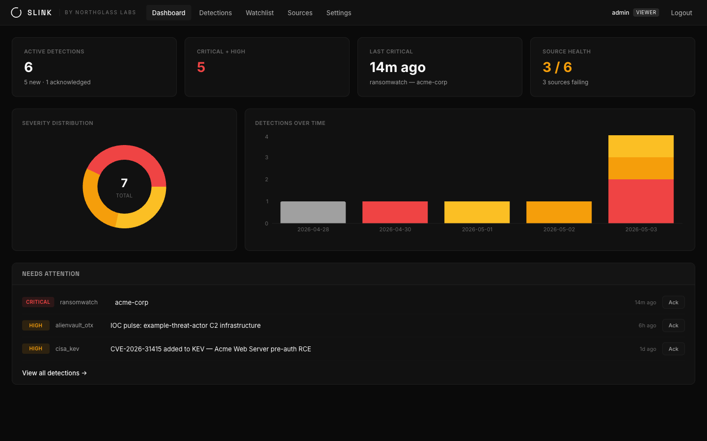
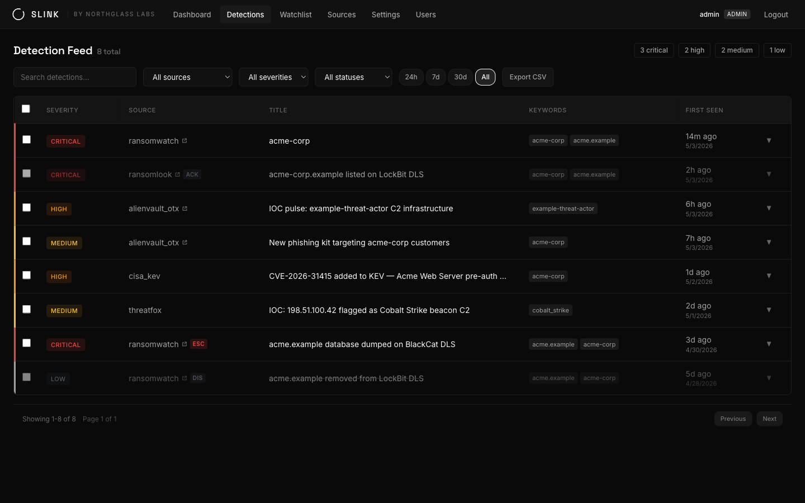
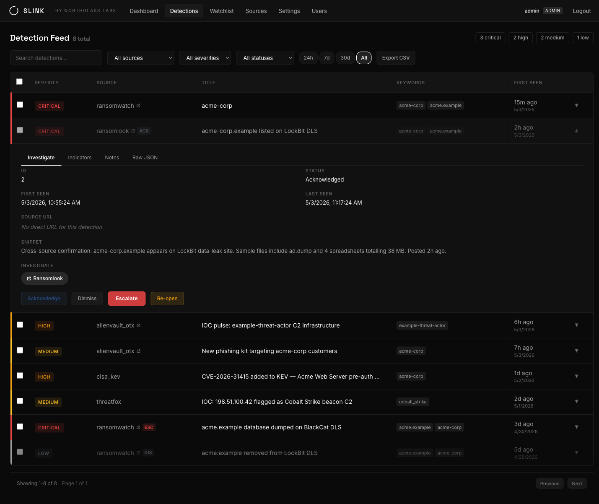
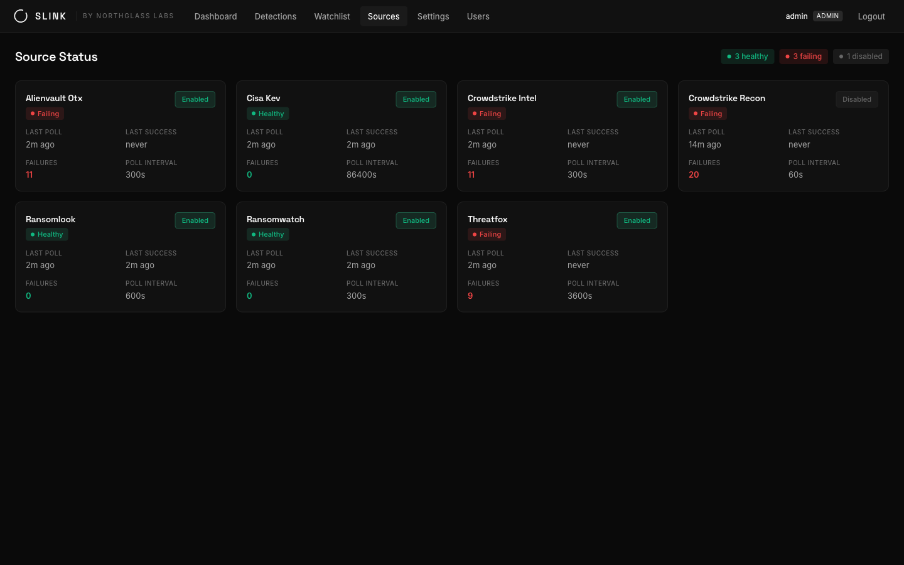
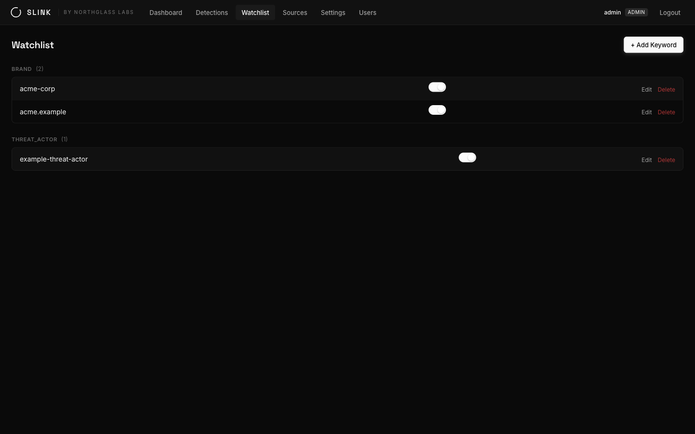
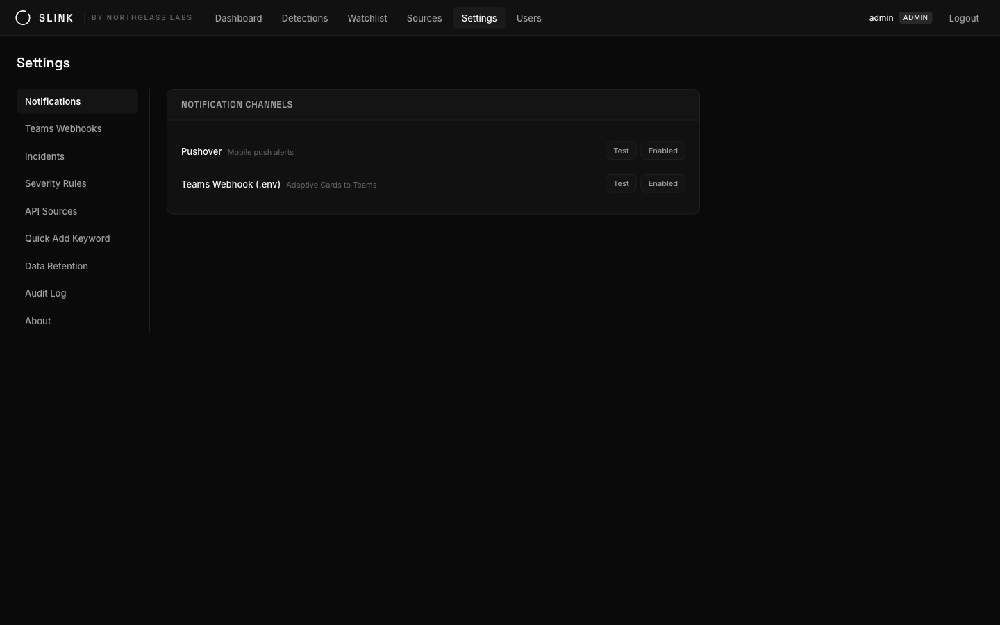
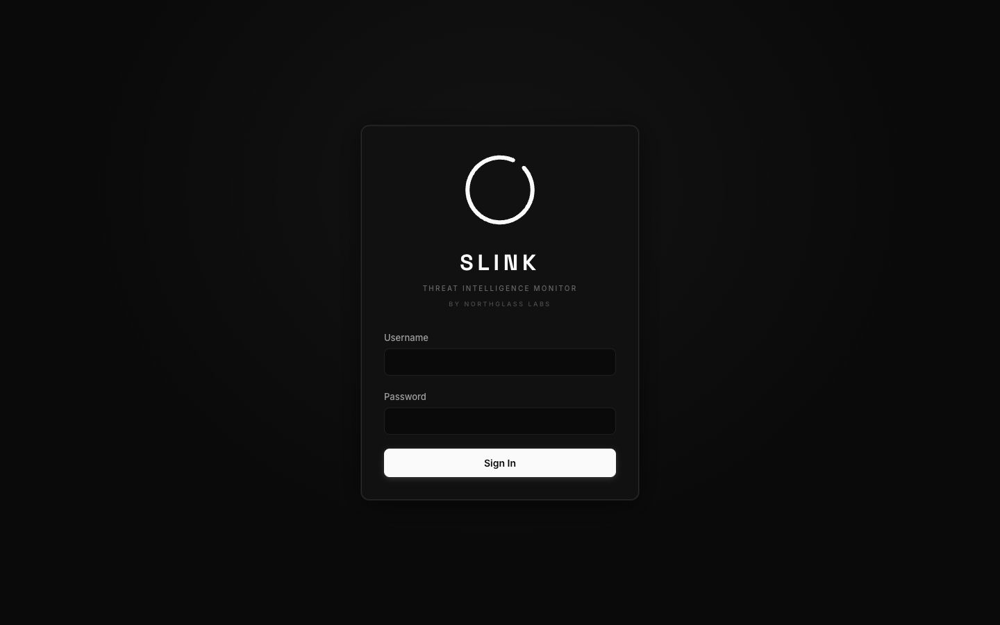
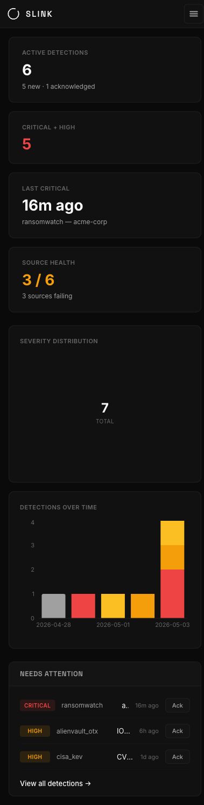
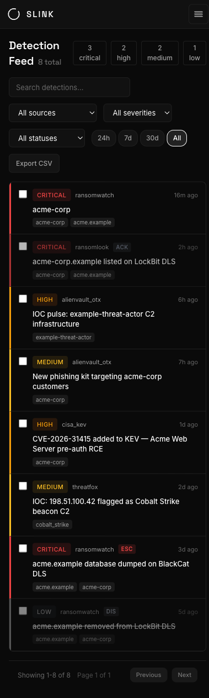

<h1 align="center">Slink</h1>

<p align="center"><b>A self-hosted threat-intelligence watchtower.</b><br />
Slink watches ransomware leak sites and OSINT feeds for the names you care about — brands, domains, threat actors — and pages you when they show up.</p>

<p align="center">
  <a href="https://northglass.io">Northglass Labs</a> ·
  <a href="https://github.com/Northglass-Labs/Slink/issues">Issues</a> ·
  <a href="docs/DEPLOYMENT.md">Deployment Guide</a> ·
  <a href="CONTRIBUTING.md">Contributing</a>
</p>

<p align="center"><sub>A <a href="https://northglass.io">Northglass Labs</a> product — small tools, built well.</sub></p>

> **Status: Beta.** Slink runs in production and the core loop — collect, match, dedupe, score, alert — is stable, but the project is young. Honest limitations, up front:
>
> - **Single-tenant by design.** One team, one deployment. See the JWT trade-off in [Security posture](#security-posture) before considering anything multi-tenant.
> - **Matching is exact.** Keywords match on word boundaries (or substring, for dotted/hyphenated terms like domains), case-insensitive. No fuzzy matching, no regex patterns — a leak-site post that misspells your brand won't match.
> - **12 collectors shipped**, more designed but not built ([roadmap below](#roadmap-collectors-not-yet-shipped)). API and schema may still change between releases; migrations run automatically, but read the [changelog](#changelog) before upgrading.
>
> Something broken or missing? [Open an issue](https://github.com/Northglass-Labs/Slink/issues).

Slink polls threat feeds you already have access to, matches every item against your keyword watchlist, deduplicates across sources, scores severity by your rules, extracts IOCs, and alerts through Pushover and Microsoft Teams. Claude Haiku can add an advisory classification to incident matches, but deterministic incident policy always retains the emergency page. The whole stack runs on a single Docker host — built for security teams and solo practitioners who want a watchtower, not a platform.

---

## Screenshots

<p align="center">
  
</p>

<table>
  <tr>
    <td width="50%"><a href="docs/screenshots/03-detections.png"></a><p align="center"><sub><b>Detection feed</b> — filters, sorting, bulk triage, CSV export</sub></p></td>
    <td width="50%"><a href="docs/screenshots/04-detection-detail.png"></a><p align="center"><sub><b>Detection detail</b> — Investigate · Indicators · Notes · Raw JSON</sub></p></td>
  </tr>
  <tr>
    <td width="50%"><a href="docs/screenshots/06-sources.png"></a><p align="center"><sub><b>Source health</b> — last poll, last success, failure count, poll interval per collector</sub></p></td>
    <td width="50%"><a href="docs/screenshots/05-watchlist.png"></a><p align="center"><sub><b>Watchlist</b> — keywords grouped by category, inline enable/disable</sub></p></td>
  </tr>
  <tr>
    <td width="50%"><a href="docs/screenshots/07-settings.png"></a><p align="center"><sub><b>Settings</b> — notification channels, severity rules, retention, audit log</sub></p></td>
    <td width="50%"><a href="docs/screenshots/01-login.png"></a><p align="center"><sub><b>Login</b> — JWT auth with refresh-token rotation and account lockout</sub></p></td>
  </tr>
</table>

<table>
  <tr>
    <td align="center" width="50%"><a href="docs/screenshots/08-mobile-dashboard.png"></a><p><sub><b>Mobile dashboard</b></sub></p></td>
    <td align="center" width="50%"><a href="docs/screenshots/09-mobile-detections.png"></a><p><sub><b>Mobile detections</b> — table collapses to cards under 640px</sub></p></td>
  </tr>
</table>

> Sample data shown above (`acme-corp`, `acme.example`, `example-threat-actor`, etc.) is the seeded placeholder set. Replace it with your own keywords from the **Watchlist** page after first login.

---

## What Slink does

- **Collects** from RansomWatch, Ransomlook, CISA KEV, the abuse.ch feeds (ThreatFox, URLhaus, MalwareBazaar, Feodo Tracker), NVD, the GitHub Advisory Database, AlienVault OTX, and (optionally) CrowdStrike Falcon Recon and Intel — every collector is independent and any subset can be disabled
- **Matches** every item against your keyword watchlist (brands, threat actors, domains, incident identifiers)
- **Deduplicates** with a two-tier hash: per-source content hash, plus a cross-source victim hash within a 24-hour window
- **Scores** severity from configurable per-source / per-keyword-category rules
- **Enriches** hits with extracted IOCs — hashes, IPs, domains, CVEs, MITRE ATT&CK IDs
- **Alerts** via Pushover (mobile push, with priority-2 emergency retry) and Teams (Adaptive Cards)
- **Triages** incident-related detections through Claude Haiku as an advisory signal without allowing model output to suppress the emergency path

The UI is a React dashboard built for analyst workflow: bulk triage, notes, keyboard shortcuts, CSV export, an audit log, and editors for keywords, incidents, and severity rules.

---

## Quick Start

Requirements: Docker + Docker Compose. Pushover and Anthropic API keys are recommended for notifications and AI triage; every other collector is optional and auto-disables when unconfigured.

```bash
git clone https://github.com/Northglass-Labs/Slink.git
cd Slink
cp .env.example .env
${EDITOR:-vi} .env             # fill in secrets — see Configuration below
./setup.sh                     # one-shot bootstrap
```

`setup.sh` checks prerequisites, starts the stack, and walks you through first login with a full smoke test. To drive it yourself instead:

```bash
docker compose up -d           # starts api, frontend, postgres
# The api container runs database migrations automatically on startup,
# so there's no separate migration step. Wait for the health check to pass:
curl -fsS http://localhost:8000/api/health
# Then visit http://localhost:5180
# Log in with ADMIN_USERNAME / ADMIN_PASSWORD from your .env
```

Once you're in, open **Watchlist** and replace the seeded example keywords with the brands, domains, and threat-actor names you actually care about.

For Kubernetes, Helm, and hardened production setups, see the [Deployment Guide](docs/DEPLOYMENT.md).

---

## Choosing your stack

Slink is the engine; you bring the data and the alert channels. Nothing below is required to bring the stack up — every collector and channel auto-disables when its credentials are missing — but the more sources you wire in, the more useful Slink becomes. Pick from each tier based on budget and threat model.

### Supported sources today

Free, no account:

| Source | What it gives you |
|--------|--------------------|
| [**RansomWatch**](https://ransomwatch.telemetry.ltd) | Aggregated ransomware leak-site posts (most known DLS groups) |
| [**Ransomlook**](https://www.ransomlook.io) | Independent leak-site index with extra coverage and freshness |
| [**CISA KEV**](https://www.cisa.gov/known-exploited-vulnerabilities-catalog) | Known Exploited Vulnerabilities catalog (CVEs exploited in the wild) |

Free, signup or auth-key required:

| Source | Auth | What it gives you |
|--------|------|--------------------|
| [**abuse.ch ThreatFox**](https://threatfox.abuse.ch) | Auth-Key (free at [auth.abuse.ch](https://auth.abuse.ch)) | Community IOC feed — IPs, hashes, URLs tagged to malware families |
| [**abuse.ch URLhaus**](https://urlhaus.abuse.ch) | Same abuse.ch Auth-Key | Active malware-distribution URLs — fills the URL/payload-delivery gap |
| [**abuse.ch MalwareBazaar**](https://bazaar.abuse.ch) | Same abuse.ch Auth-Key | Fresh malware-sample hashes with YARA hits and tags |
| [**abuse.ch Feodo Tracker**](https://feodotracker.abuse.ch) | Same abuse.ch Auth-Key | Active C2 IPs for banker / loader families (Emotet, Dridex, TrickBot, QakBot, IcedID) |
| [**NVD CVE feed**](https://nvd.nist.gov/developers/vulnerabilities) | None (API key optional, lifts rate limit) | Raw CVE catalog with CVSS, CPE, refs — pairs with KEV for a "known + exploited" view |
| [**GitHub Advisory Database**](https://github.com/advisories) | GitHub PAT (no scopes needed) | GHSA records — often earlier than NVD for OSS-package CVEs |
| [**AlienVault OTX**](https://otx.alienvault.com) | Account + API key | Pulse feed of community-curated IOCs and reports |

> The four abuse.ch collectors share a single Auth-Key — register once at [auth.abuse.ch](https://auth.abuse.ch) and all four light up.

Paid / enterprise (optional, fully-supported peers to the free collectors):

| Source | Auth | What it gives you |
|--------|------|--------------------|
| [**CrowdStrike Falcon Recon**](https://www.crowdstrike.com/platform/threat-intelligence/falcon-recon/) | Falcon API client ID + secret | Continuous monitoring of breach forums, marketplaces, leak sites against your rules |
| [**CrowdStrike Falcon Intel**](https://www.crowdstrike.com/platform/threat-intelligence/) | Same Falcon API creds | Curated indicators tied to threat actors with full eCrime / nation-state context |

**Minimum recommended for solo operators:** RansomWatch + Ransomlook + CISA KEV (all free, no accounts), plus the abuse.ch feeds once you grab a free Auth-Key. That gets you ransomware DLS coverage and IOC + KEV enrichment at zero ongoing cost. Add AlienVault OTX and the GitHub Advisory Database next; only reach for the paid tier if you already have a CrowdStrike contract.

### Roadmap (collectors not yet shipped)

Designed in, ranked by next-up priority. Contributions welcome — see [`docs/COLLECTORS.md`](docs/COLLECTORS.md) for the plug-in pattern.

| # | Source | Cost | Why we want it |
|---|--------|------|----------------|
| 1 | [**GreyNoise Community**](https://greynoise.io/community) | Free (API key optional) | Per-IP scanner classification — used as *enrichment* to deprioritise noisy detections, not as a feed |
| 2 | [**MISP default feeds**](https://www.misp-project.org/feeds/) | Free | One MISP-event parser unlocks 60+ aggregated community feeds |
| 3 | [**CISA Cybersecurity Advisories (JSON)**](https://www.cisa.gov/news-events/cybersecurity-advisories) | Free | Full advisory IOCs + TTPs — complements KEV's exploited-only list |

Niche / situational additions under consideration: abuse.ch SSLBL (TLS / JA3), Shodan InternetDB (asset enrichment), PhishTank, Ransomware.live (third-source ransomware triangulation), country-CSIRT feeds.

Intentionally **not** on the roadmap: Twitter/X (API cost, fragile scraping), Pastebin scraping (API gone), DIY Telegram channel scraping (legal grey zone — use Ransomlook), Mastodon (no IOC-structured convention), generic GitHub IOC repo mirrors (stale, redundant with MISP feeds). Slink also never polls OpenCTI or other TI platforms — those are peers, not sources.

### Notification channels

| Channel | Cost | Best for |
|---------|------|----------|
| [**Pushover**](https://pushover.net) | $5 one-time per platform | Real-time mobile push with priority-2 emergency retry until acknowledged on device |
| **Microsoft Teams** (incoming webhook OR Graph API) | Free with M365 | Team-visible Adaptive Cards; useful when multiple analysts triage together |
| **Dashboard only** | Free | If you'd rather pull than be paged |

If you can only pick one, pick Pushover — the priority-2 retry is the difference between waking up at 3am for a real critical and finding Slink's stuck queue at 9am. Setup walkthrough: [`docs/pushover-setup.md`](docs/pushover-setup.md).

### AI triage (recommended)

| Service | Cost | Notes |
|---------|------|-------|
| [**Anthropic API**](https://console.anthropic.com) — Claude Haiku | Pay-as-you-go | Slink can classify each incident-linked detection as advisory context. Deterministic incident matches always page, including when AI is absent, unavailable, or returns `ROUTINE`. Daily, per-user, and concurrency limits bound interactive AI-summary use. |

Slink uses the smaller Haiku model and exposes daily, per-user, and concurrency
limits so operators can bound usage explicitly.

---

## Configuration

For Docker Compose, every secret lives in the ignored `.env` file and nothing
is baked into an image. Kubernetes deployments use out-of-band Secrets.

| Variable | Required? | Purpose |
|----------|-----------|---------|
| `DATABASE_URL` | yes | `postgresql+asyncpg://slink:<password>@db:5432/slink` |
| `POSTGRES_PASSWORD` | yes | Password used by the Postgres container |
| `SECRET_KEY` | yes | JWT signing key — generate with `openssl rand -hex 32` |
| `ADMIN_USERNAME` / `ADMIN_PASSWORD` | yes | Seeded administrator on first boot; production mode rejects weak placeholders |
| `APP_ENV` | yes in prod | Set explicitly to `production` to activate fail-closed runtime validation |
| `ANTHROPIC_API_KEY` | recommended | Enables AI triage of incident-related detections |
| `PUSHOVER_API_TOKEN` / `PUSHOVER_USER_KEY` | recommended | Mobile alerts (get at pushover.net) |
| `TEAMS_WEBHOOK_URL` | optional | Incoming webhook for Teams notifications |
| `CS_CLIENT_ID` / `CS_CLIENT_SECRET` | optional | CrowdStrike Falcon collectors |
| `OTX_API_KEY` | optional | AlienVault OTX collector (free at otx.alienvault.com) |
| `SECURE_COOKIES` | prod only | Set `true` when deployed behind HTTPS |
| `SLINK_BASE_URL` | prod only | External URL used in notification deep-links |
| `TRUSTED_PROXY_CIDRS` | reverse proxy only | Exact direct proxy addresses allowed to supply forwarding headers; empty trusts none |
| `AI_SUMMARY_*` | optional | Daily, per-user, concurrency, and lease bounds for interactive summaries |

Unconfigured collectors are auto-disabled — start with just Pushover + Anthropic and add more over time.

---

## Ports

| Port | Service |
|------|---------|
| `5180` | Frontend (Vite dev server) |
| `8000` | API (FastAPI) |
| `5434` | PostgreSQL |

The production compose adds an nginx reverse proxy on `443` with HSTS, CSP, and security headers pre-configured. Drop your TLS certs into `nginx/certs/` and:

```bash
docker compose -f docker-compose.yml -f docker-compose.prod.yml up -d --build
```

---

## Watchlist & Incidents

**Keywords** are the brands, domains, actors, or arbitrary terms you want to match. Each has a category — `brand`, `threat_actor`, or anything you invent — and can be linked to one or more **incidents**. When a detection's matched keywords overlap with an active incident, the AI triage path is engaged.

Severity is computed from **severity rules**, editable in the UI. Each rule pairs a source pattern or keyword category with a base severity and a priority. Rules stack in priority order; the first match wins.

---

## Notification tiers

| Tier | Trigger | Channel | Behavior |
|------|---------|---------|----------|
| Emergency | Deterministic active-incident match (AI advisory cannot downgrade) | Pushover priority 2 + Teams | Retries every 3 min until acknowledged on device |
| Urgent | Critical or high severity | Pushover | One digest per poll cycle per source |
| Medium | Medium severity | Teams | 15-minute batched Adaptive Card |
| Low | Everything else | Dashboard only | No push |

Any channel can be toggled on or off from Settings → Notification Channels without editing env vars.

---

## Development

Backend tests:

```bash
cd backend
python -m venv .venv && source .venv/bin/activate
pip install --require-hashes -r requirements-dev.lock
DATABASE_URL=<dev-db> TEST_DATABASE_URL=<test-db> \
  pytest --cov=app --cov-report=term-missing --cov-fail-under=65
```

Frontend:

```bash
cd frontend
npm ci
npm run dev      # Vite dev server (proxies /api to the backend container)
npm run build
```

Database migrations run automatically when the api container starts (see `backend/entrypoint.sh`), so a normal `docker compose up` needs no manual step. To author a new migration:

```bash
cd backend
alembic revision --autogenerate -m "description"
alembic upgrade head        # applied automatically on next container start
```

Add extra users from the CLI:

```bash
docker compose exec api python -m app.utils.create_user <username> [admin|viewer]
# The command prompts twice for the password without placing it in process arguments.
```

Adding a collector or notification channel? See [CONTRIBUTING.md](CONTRIBUTING.md) — both are designed as small, self-contained plug-ins.

---

## Security posture

Slink is a tool for security professionals, so the defaults are locked down:

- **Authentication:** JWT access tokens (15 min) + httpOnly refresh cookies (8 hours). Logout bumps a per-user token version, immediately invalidating any outstanding tokens (including ones an attacker may have copied).
- **Account protection:** A PostgreSQL-backed limiter enforces 5 login attempts per minute across workers. Forwarding headers are honored only from explicitly trusted direct proxies, and locked/unknown accounts follow uniform failure behavior with equivalent password-hash work.
- **Production guardrails:** `APP_ENV=production` fails startup unless JWT, admin, database, HTTPS base-URL, and Secure-cookie requirements are satisfied. Persisted weak bootstrap credentials are also rejected.
- **Data redaction:** `raw_data` (the full source payload — may contain PII) is admin-only. Structured log output redacts values for keys matching `password`, `secret`, `token`, `api_key`, etc.
- **SSRF protection:** Webhooks are HTTPS-only and provider-allowlisted. Public DNS is resolved immediately before each POST, and the connection is pinned to that validated address with redirects and environment proxies disabled.
- **Input hardening:** CSV export neutralizes formula injection (`=WEBSERVICE(...)`). Indicator search escapes SQL LIKE wildcards. Sort columns, incident roles, and app-settings values are all typed allowlists.
- **AI hardening:** Prompt content is escaped and treated as untrusted data; deterministic incident policy cannot be downgraded by model output. Interactive summaries are admin-only, exclude raw upstream payloads, enforce shared budgets/concurrency, and accept only bounded schema-validated output.

**Known trade-offs, stated plainly:**

- The short-lived (15 min) JWT access token is held in browser `localStorage`, so it is readable by any script running on the page and therefore exposed to XSS. The long-lived refresh token stays in an httpOnly cookie, out of reach of scripts. For a self-hosted, single-tenant deployment this is an accepted trade-off; if you plan to expose Slink multi-tenant or as a public SaaS, move the access token to memory or an httpOnly cookie first.

See [SECURITY.md](SECURITY.md) for supported versions, deployment assumptions, and private vulnerability reporting.

---

## Project layout

```
backend/
  app/
    collectors/      # One file per source. Extend BaseCollector + register.
    models/          # SQLAlchemy ORM
    routers/         # Thin FastAPI controllers
    schemas/         # Pydantic request/response
    services/        # detection_engine, scheduler, notifier, triage
  alembic/versions/  # DB migrations
  tests/
frontend/
  src/
    pages/           # Route-level components
    components/      # Shared UI
    queries/         # React Query hooks
nginx/               # Reverse proxy config + cert mount point
docs/                # Deployment guide, collector guide, roadmap
```

---

## About

Slink is built by [Northglass Labs](https://northglass.io), a security and software studio. Born from years of incident response and information security work, we build the tools we kept wishing existed — small, focused, and open source by default. Questions or security reports: [hello@northglass.io](mailto:hello@northglass.io).

## Acknowledgments

Slink is an aggregator — the real work happens upstream. Thanks to the people and teams who publish the data Slink watches: [RansomWatch](https://ransomwatch.telemetry.ltd), [Ransomlook](https://www.ransomlook.io), [abuse.ch](https://abuse.ch) (ThreatFox, URLhaus, MalwareBazaar, Feodo Tracker), [CISA](https://www.cisa.gov/known-exploited-vulnerabilities-catalog), [NVD](https://nvd.nist.gov), the [GitHub Advisory Database](https://github.com/advisories), and the [AlienVault OTX](https://otx.alienvault.com) community. Use their feeds within their terms, and support the free ones if you can.

## Contributing

See [CONTRIBUTING.md](CONTRIBUTING.md) for development setup, the collector plug-in pattern, and the pull-request checklist.

## Changelog

### Unreleased

- **Security:** explicit production guards, rotating refresh sessions, trusted-proxy rate limiting, DNS-pinned HTTPS webhooks, bounded AI output, and sensitive-log redaction.
- **Operations:** hash-locked dependencies, digest-pinned container bases, fail-closed deployment manifests, non-root read-only runtimes, and client-encrypted backups.
- **Fix:** the API entrypoint now applies migrations before startup, so clean Compose and Kustomize deployments have one migration owner and no first-boot race.
- **Docs:** deployment assumptions, limitations, supported collectors, and private vulnerability reporting are documented for public release.

---

## License

MIT. See [`LICENSE`](LICENSE).
